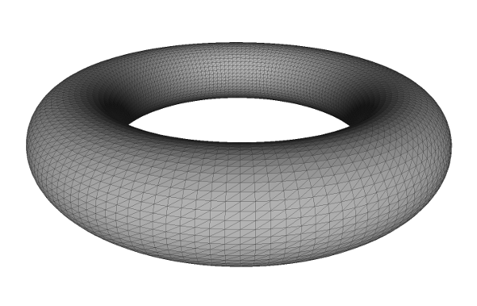

#  SpliPy

This repository contains the SpliPy packages. SpliPy is a pure python library
for the creation, evaluation and manipulation of B-spline and NURBS geometries.
It supports n-variate splines of any dimension, but emphasis is made on the
use of curves, surfaces and volumes. The library is designed primarily for
analysis use, and therefore allows fine-grained control over many aspects which
is not possible to achieve with conventional CAD tools.

## Features

SpliPy allows for the generation of parametric curves, surfaces and volumes in the form of non-uniform rational B-splines (NURBS). It supports traditional curve- and surface-fitting methods such as (but not limited to)

### Curve fitting
* Bezier curves
* Hermite Interpolation
* Cubic Curve Interpolation
* B-spline Interpolation
* Least Square Fit

### Surface operations
* Sweep
* Revolve
* Loft
* Edge_Curves (interior from four edges)
* Extrude
* Structured Point Cloud Interpolation
* Least Square Fit

**Revolve**


**Sweep**


**Loft**


### Volume operations
* Revolve
* Extrude
* Loft
* Structured Point Cloud Interpolation
* Least Square Fit

In addition to these basic building blocks, it also supports a number of primitive shapes such as (but not limited to)

### Primitive shapes
* Cube
* Circle
* Disc
* Cylinder
* Torus
* Teapot

## Examples

### Derivatives of spline curves
``` python
  from splipy import *
  import numpy as np

  n = 250                                  # number of evaluation points
  c = curve_factory.circle()               # create the NURBS circle (r=1)
  t = np.linspace(c.start(0), c.end(0), n) # parametric evaluation points
  x = c(t)                                 # physical (x,y)-coordinates, size (n,2)
  v = c.derivative(t, 1)                   # velocity at all points
  a = c.derivative(t, 2)                   # acceleration at all points
```


### Curve fitting
Lissajous curves are a family of parametric curves of the type

```
x = A sin(at+d)
y = B sin(bt)
```

More info: [https://en.wikipedia.org/wiki/Lissajous_curve](https://en.wikipedia.org/wiki/Lissajous_curve). Stripping the [animation parts of the code](https://github.com/sintefmath/Splipy/blob/master/examples/lissajous.py), one can generate these curves in the following way


``` python
from splipy import *
import numpy as np
from fractions import gcd

def lissajous(a, b, d):
  # request a,b integers, so we have closed, periodic curves
  n = np.gcd(a,b)
  N = (a/n) * (b/n) # number of periods before looping

  # compute a set of interpolation points
  numb_pts = max(3*N, 100) # using 3N interpolation points is decent enough
  t = np.linspace(0,2*np.pi/n, numb_pts)
  x = np.array([np.sin(a*t + d), np.sin(b*t)])

# do a cubic curve interpolation with periodic boundary conditions
my_curve = curve_factory.cubic_curve(x.T, curve_factory.Boundary.PERIODIC)
```

")

Animation of the lissajous curve with a=3, b=4 and d=pi/2

### Surface Sweep

This produces the trefoil knot shown above

``` python
from splipy import *
from numpy import pi,cos,sin,transpose,array,sqrt

# define a parametric representation of the trefoil knot (to be sampled)
def trefoil(u):
  x = [41*cos(u) - 18*sin(  u) -  83*cos(2*u) - 83*sin(2*u) - 11*cos(3*u) + 27*sin(3*u),
       36*cos(u) + 27*sin(  u) - 113*cos(2*u) + 30*sin(2*u) + 11*cos(3*u) - 27*sin(3*u),
       45*sin(u) - 30*cos(2*u) + 113*sin(2*u) - 11*cos(3*u) + 27*sin(3*u)]
  return transpose(array(x))

knot_curve   = curve_factory.fit(trefoil, 0, 2*pi) # adaptive curve fit of trefoil knot
square_curve = 15 * curve_factory.n_gon(4)         # square cross-section
my_surface   = surface_factory.sweep(crv, square)  # sweep out the surface
```

### Working with the controlpoints

``` python
>>> from splipy import *
>>> my_curve = curve_factory.circle(r=3)
>>> print(my_curve[0])
[3. 0. 1.]
>>> print(my_curve[1])
[2.12132034 2.12132034 0.70710678]
>>> for controlpoint in my_curve:
...     print(controlpoint)
[3. 0. 1.]
[2.12132034 2.12132034 0.70710678]
[0. 3. 1.]
[-2.12132034  2.12132034  0.70710678]
[-3.  0.  1.]
[-2.12132034 -2.12132034  0.70710678]
[ 0. -3.  1.]
[ 2.12132034 -2.12132034  0.70710678]
```

### Creating STL files

STL files are used extensively for 3D representation and is one of the only supported formats for 3D printing.

``` python
from splipy.io import STL
from splipy import surface_factory

# create a NURBS torus
my_torus = surface_factory.torus(minor_r=1, major_r=4)

# STL files are tessellated linear triangles. View with i.e. meshlab
with STL('torus.stl') as my_file:
    my_file.write(my_torus, n=(50, 150)) # specify resolution of 50x150 evaluation pts
```

**Torus tessellation as viewed in Meshlab**



## Citations

If you use Splipy in your work, please consider citing
[K. A. Johannessen and E. Fonn 2020 *J. Phys.: Conf. Ser.* **1669** 012032](https://iopscience.iop.org/article/10.1088/1742-6596/1669/1/012032/meta).
